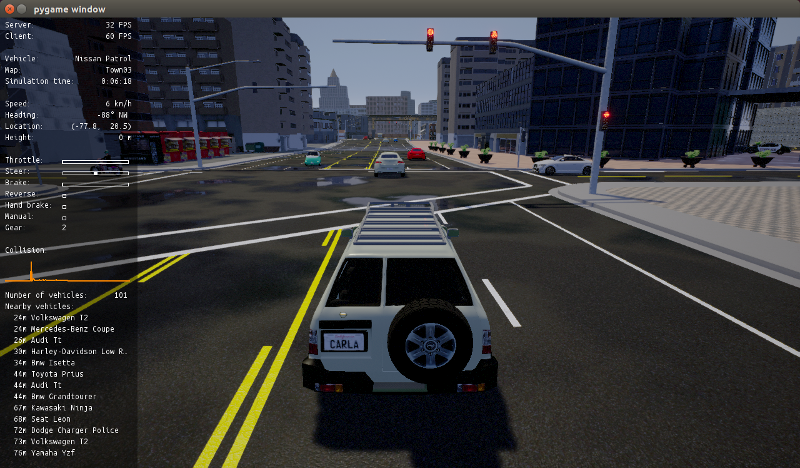

<h1>Getting started with CARLA</h1>


!!! important
    This tutorial refers to the latest development versions of CARLA, 0.9.0 or
    later. For the documentation of the stable version please switch to the
    [stable branch](https://carla.readthedocs.io/en/stable/getting_started/).

Welcome to CARLA! This tutorial provides the basic steps for getting started
using CARLA.

CARLA consists mainly of two modules, the **CARLA Simulator** and the **CARLA
Python API** module. The simulator does most of the heavy work, controls the
logic, physics, and rendering of all the actors and sensors in the scene; it
requires a machine with a dedicated GPU to run. The CARLA Python API is a module
that you can import into your Python scripts, it provides an interface for
controlling the simulator and retrieving data. With this Python API you can, for
instance, control any vehicle in the simulation, attach sensors to it, and read
back the data these sensors generate. Most of the aspects of the simulation are
accessible from our Python API, and more will be in future releases.

<h2>How to run CARLA</h2>

First of all, download the latest release from our GitHub page and extract all
the contents of the package in a folder of your choice.

<!-- Latest release button -->
<p align="middle"><a href="https://github.com/carla-simulator/carla/blob/master/Docs/download.md" target="_blank" class="btn btn-neutral" title="Go to the latest CARLA release"><span class="icon icon-github"></span> Get the latest release</a></p>

The release package contains a precompiled version of the simulator, the Python
API module, and some Python scripts with usage examples. In order to run our
usage examples, you may need to install the following Python modules

```sh
pip install --user pygame numpy
```

Let's start by running the simulator. Launch a terminal window and go to the
folder you extracted CARLA to. Start the simulator with the following command

```sh
# Linux
./CarlaUE4.sh
```

```cmd
rem Windows
CarlaUE4.exe
```

this launches a window with a view over the city. This is the "spectator"
view, you can fly around the city using the mouse and WASD keys, but you cannot
interact with the world in this view. The simulator is now running as a server,
waiting for a client app to connect and interact with the world.

!!! note
    CARLA requires two available TCP ports on your computer, by default 2000 and
    2001. Make sure you don't have a firewall or another application blocking
    those ports. Alternatively, you can manually change the port by launching
    the simulator with the command-line argument `-carla-port=N`, the second
    port will be automatically set to `N+1`.

Let's add now some life to the city, open a new terminal window and execute

```sh
python spawn_npc.py -n 80
```

With this script we are adding 80 vehicles to the world driving in "autopilot"
mode. Back to the simulator window we should see these vehicles driving around
the city. They will keep driving randomly until we stop the script. Let's leave
them there for now.

Now, it's nice and sunny in CARLA, but that's not a very interesting driving
condition. One of the cool features of CARLA is that you can control the weather
and lighting conditions of the world. We'll launch now a script that dynamically
controls the weather and time of the day, open yet another terminal window and
execute

```sh
python dynamic_weather.py
```

The city is now ready for us to drive, we can finally run

```sh
python manual_control.py
```

This should open a new window with a 3rd person view of a car, you can drive
this car with the WASD/arrow keys. Press 'h' to see all the options available.



As you have noticed, we can connect as many scripts as we want to control the
simulation and gather data. Even someone with a different computer can jump now
into your simulation and drive along with you

```sh
python manual_control.py --host=<your-ip-address-here>
```

<br>
Now that we covered the basics, in the next section we'll take a look at some of
the details of the Python API to help you write your own scripts.
