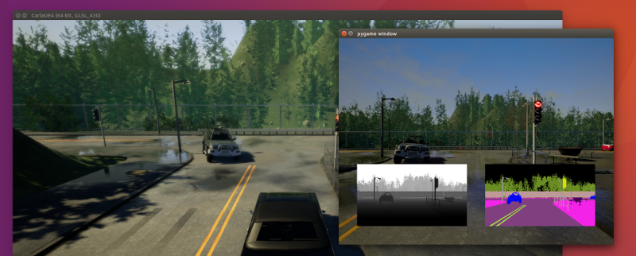

<h1>Python API overview</h1>



First we need to introduce a few core concepts:

  - **Actor:** Actor is anything that plays a role in the simulation and can be
    moved around, examples of actors are vehicles, pedestrians, and sensors.
  - **Blueprint:** Before spawning an actor you need to specify its attributes,
    and that's what blueprints are for. We provide a blueprint library with
    the definitions of all the actors available for you to choose.
  - **World:** The world represents the currently loaded map and contains the
    functions for converting a blueprint into a living actor.

For the full list of methods available take a look at the
[Python API reference](python_api.md).

#### Connecting and retrieving the current world

To connect to a simulator we need to create a "Client" object providing IP
address and port of a running instance of the simulator.

```py
client = carla.Client('localhost', 2000)
```

It is very convenient to set the time-out, otherwise networking operations may
block forever.

```py
client.set_timeout(10.0) # seconds
```

Next step is retrieving the active world, we use this world for spawning actors,
changing weather, and getting road info.

```py
world = client.get_world()
```

#### Blueprint library

Before we can create an actor, we need to take a look at the blueprint library.

```py
blueprint_library = world.get_blueprint_library()
```

You can filter with wildcards.

Some of the attributes of the blueprints can be modified.

#### Spawning actors

Let's just go for a practical example. The following code adds a red Mustang to
the simulation and enables its autopilot so the car can drive freely around the
city on its own

```py
blueprint = blueprint_library.find('vehicle.ford.mustang')
blueprint.set_attribute('color', '255,0,0')

transform = carla.Transform(carla.Location(x=230, y=195, z=40), carla.Rotation(yaw=180))

vehicle = world.spawn_actor(blueprint, transform)
```

Spawn actor function has two flavours, `spawn_actor` and `try_spawn_actor`.

#### Handling actors

Actors can also be teleported and moved around the city, for that we have
exposed the `set_location` and `set_transform` methods

```py
location = vehicle.get_location()
location.x += 10.0
vehicle.set_location(location)
```

`get_transform()`, `get_velocity()`, `get_acceleration()`.

`set_simulate_physics(False)`.

Once we are tired of an actor we can remove it from the simulation with

```py
vehicle.destroy()
```

#### Vehicles

and in the special case of vehicles, they can be controlled too in the usual way

```py
vehicle.apply_control(carla.VehicleControl(throttle=1.0, steer=-1.0))
```

These are all the parameters of the VehicleControl

```py
carla.VehicleControl(
    throttle = 0.0
    steer = 0.0
    brake = 0.0
    hand_brake = False
    reverse = False
    manual_gear_shift = False
    gear = 0)
```

`set_autopilot()`, `bounding_box`.

#### Sensors

Now let's attach a camera to this vehicle so we can take a look at what's going
on, we are going to save this images to disk

```py
blueprint = world.get_blueprint_library().find('sensor.camera.rgb')
transform = carla.Transform(carla.Location(x=0.5, z=1.8))
camera = world.spawn_actor(blueprint, transform, attach_to=vehicle)

camera.listen(lambda image: image.save_to_disk('%06d.png' % image.frame_number))
```

the callback function passed to the `listen` method will be called every time a
new image is received. This callback is executed asynchronously, this
considerably speeds up the parsing of images. Now it is possible to do things
like saving images to disk keeping up with the speed of the simulator.

#### Other actors

#### Changing the weather

#### Map
