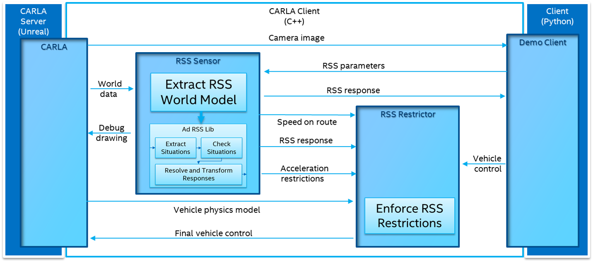
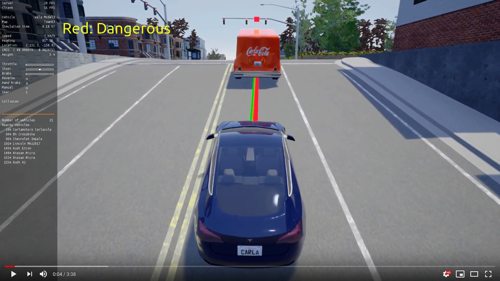

<h1>AD Responsibility Sensitive Safety model (RSS) integration</h1>

> _This feature is a work in progress, only a Linux build variant is available._

This feature integrates the [C++ Library for Responsibility Sensitive Safety](https://github.com/intel/ad-rss-lib) into the CARLA Client library.

It provides basic implementations of both a **RssSensor**, the situation analysis and response generation by the **ad-rss-lib** and a basic **RssRestrictor** class which applies the restrictions to given vehicle commands.
The following image sketches the integration of **RSS** into the CARLA architecture:


The **RssSensor** results can be visualized within CARLA.
[](https://www.youtube.com/watch?v=UxKPXPT2T8Q)

Please see [C++ Library for Responsibility Sensitive Safety documentation](https://intel.github.io/ad-rss-lib/) and especially the [Background documentation](https://intel.github.io/ad-rss-lib/ad_rss/Overview/) for further details.

<h2>Compilation</h2>

RSS integration is a Linux-only build variant.
Please see [Build System](build_system.md) for general information.
Furthermore, there are additional prerequisites required for building RSS and its dependencies (see also [**ad-rss-lib**](https://intel.github.io/ad-rss-lib/BUILDING)); briefly:

Dependencies provided by Ubunutu (>= 16.04):
```sh
sudo apt-get install libgtest-dev libpython-dev libpugixml-dev libproj-dev libtbb-dev
```

As the dependencies are built using [colcon](https://colcon.readthedocs.io/en/released/user/installation.html) you have to install the following:
```sh
pip3 install --user -U colcon-common-extensions
```

Additional dependencies for the python bindings:
```sh
sudo apt-get install castxml
pip install --user pygccxml
pip install --user https://bitbucket.org/ompl/pyplusplus/get/1.8.1.zip
```

Once this is done, the full set of dependencies and RSS components can be built calling the following.

_LibCarla_ with RSS has the be explicitly compiled by

```sh
make LibCarla.client.rss
```

The _PythonAPI_ with RSS is built by

```sh
make PythonAPI.rss
```

<h2>Current state</h2>

<h3>RssSensor</h3>

The RssSensor is supporting the full spectrum of [**ad-rss-lib** v3.0.0 feature set](https://intel.github.io/ad-rss-lib/RELEASE_NOTES_AND_DISCLAIMERS), including intersections and [stay on road](https://intel.github.io/ad-rss-lib/ad_rss_map_integration/HandleRoadBoundaries/) support.

<h3>RssRestrictor</h3>

The current implementation of the RssRestrictor checks and potentially modifies a given _VehicleControl_ generated by e.g. and Automated Driving stack or user input via a _manual_control_ client (see the _PythonAPI/examples/manual_control_rss.py_).

Due to the structure of _VehicleControl_ (just throttle, brake, streering values for the car under control), the Restrictor modifies and sets these values to best reach the desired accelerations or decelerations by a given restriction. Due to car physics and the simple control options these might not be met. While in an automated vehicle controller it might be possible to adapt the planned trajectory to meet the requirements of the restrictions and to use a fast control loop (e.g. > 1KHz) to ensure these are followed, the simple _RssRestrictor_ intervenes in lateral direction simply by counter steering towards the parallel lane direction and activates the brake, if deceleration requested by RSS, depending on vehicle mass and brake torques provided by the CARLA vehicle.
